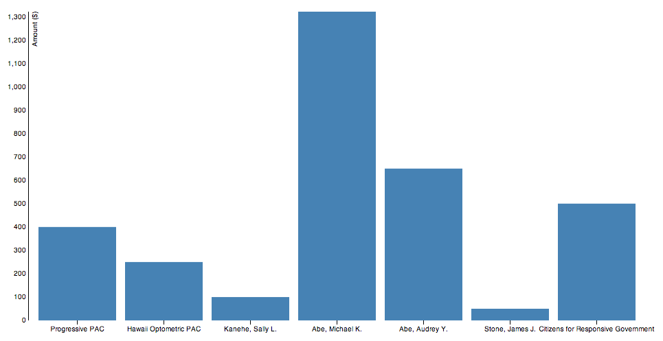

# Intro
This starter package is a single page HTML file that pulls in live data from data.hawaii.gov and displays it as a barchart using D3.js. The starter package was created for [Civic*Celerator 2013](http://civic.celerator.org/) but has applicability for any data.hawaii.gov spreadsheet data.

[View Demo Online](http://codeforhawaii.github.io/campaign_finance_starter_package/)

# Overview
This starter package combines the following:
* data.hawaii.gov campaign finance data
  * Pulled in via Socrata SODA Rest API
* D3.js
  * For visualization of the data (currently with a simple bar chart)
* jquery
  * For general page manipulation

You can either view the [demo](http://codeforhawaii.github.io/campaign_finance_starter_package/) online or view it locally by saving the [index.html](index.html) locally and opening it in your browser. If you save it locally making edits is easy. Just modify the file and refresh your browser.

## Details
How to get the url for a data set from the data.hawaii.gov (Socrata) link:

Take a URL and look for the unique id at the end. In this case it is `3maa-4fgr`:
https://data.hawaii.gov/Community/Expenditures-Made-By-Hawaii-State-and-County-Candi/3maa-4fgr

Then add it to this url `https://data.hawaii.gov/resource/<unique-id>.json` (adding json at the end), resulting in `https://data.hawaii.gov/3maa-4fgr.json`

Add info about what you can filter on
Reference: http://dev.socrata.com/consumers/getting-started

# Development/Contributing

The [index.html](index.html) page is actually generated using [Jekyll](http://jekyllrb.com/) to make editing the separate javascript files easier.

If you'd like to contribute to the starter package, simply fork the repo, push your commits, and submit your pull request.
