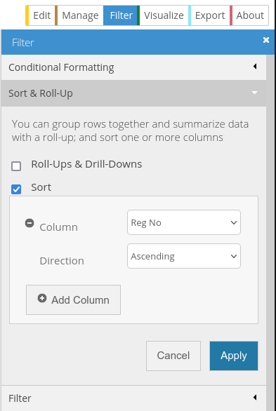

# Intro
This project is a vizualization of Hawaii Campaign Spending data for Candidates. It was initially created for [Civic*Celerator 2013](http://civic.celerator.org/).

[View Online](http://viz.hawaiicampaignspending.com)

Please note that this visualization is based on the official Hawaii Campaign
Spending data which you can find on data.hawaii.gov:
https://data.hawaii.gov/Community/Expenditures-Made-By-Hawaii-State-and-County-Candi/3maa-4fgr

But the data is actually pulled from a filtered/rolled-up view:
https://data.hawaii.gov/Community/Expenditures-Made-By-Hawaii-State-and-County-Candi/gvuk-nbsz/data

Also the Candidate Committee report is used:
https://hicscdata.hawaii.gov/dataset/Organizational-Reports-For-Hawaii-State-and-County/gkek-wbij

My sorted view of the dataset:
https://hicscdata.hawaii.gov/dataset/Organizational-Reports-For-Hawaii-State-and-County/8ry8-ip7m/data

To better understand the data you should take a look at the [Campaign Finance Data Primer](https://docs.google.com/document/d/1VC0of6-rLtFrLmpBS8xWDLjLvtoPOr9LBfDJLYy_4fw/edit)

# Development/Contributing

## Installation/Running

    bundle install
    ./run-jekyll.sh
    ./jekyll-watch.sh

Visit http://localhost:4000 in a web browser

## Getting a Socrata API key

After creating a filtered/rolled-up view as above

    curl 'https://hicscdata.hawaii.gov/api/api_keys' -i -X POST -H 'Content-Type: application/json'  -H 'Accept-Language: en-US,en;q=0.5' --compressed -H 'Pragma: no-cache' -H 'Cache-Control: no-cache' --data '{"keyName": "Example key."}' -u "$USERNAME@$PASSWORD"

Then put your api key username and password key in `.env` (based on `.env.sample`)

NOTE: The username is the `keyId` field and the password is the `keySecret` field

## Updating Data

In this project the data is updated manually rather than automatically fetched (this may change in the future).

    bundle exec dotenv ./update_data.sh

Then commit the changes to the data (if any) and then deploy.

Then run:

    bundle exec ruby parse.rb

## Deploying

Run deploys script

    ./deploy.sh

Then commit the changes. The site is served from the master branch of the common cause repo: https://github.com/CommonCauseHawaii/campaign_spending

## Contributing

If you'd like to contribute, simply fork the repo, push your commits, and submit your pull request.
